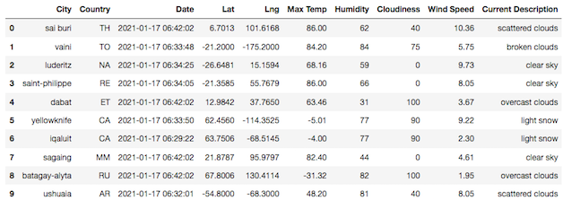
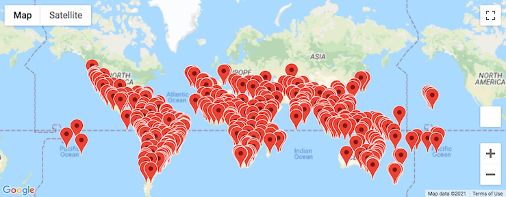
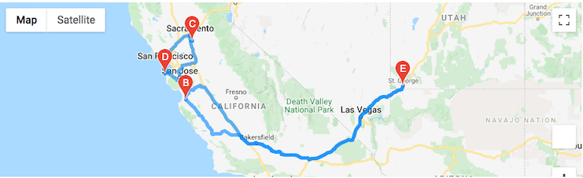
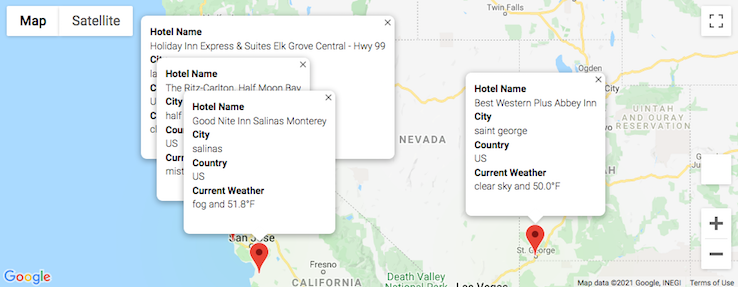

# World Weather Analysis

### Overview of Project
My colleague Jack loves the PlanMyTrip app as do the beta testers. As with any new product, they’ve recommended a few changes to take the app to the next level. Specifically, they recommend adding the weather description to the weather data that I have already retrieved. I made a variety of tools to assist travelers on their vacations and trips around the world. For this project I utilized the Google Maps Directions API in an attempt to create a travel route between four cities as well as a marker layer map.

### Project Purpose & Background
The purpose of this analysis is to visualize various world weather conditions and place them in dataframes as well as create tools that assist travelers on their vacations and their trips all over the world.

# Resources Used
- Data Source For API Calls: https://openweathermap.org/api, https://Google.com/maps

- Software: Jupyter Notebook, Pandas Library, CityPy, Python Request, APIs, JSON Traversals


## Summary

### Part 1
- A set of 2,000 random latitudes and longitudes were generated.
- Getting the nearest city using the citipy module.
- Performing an API call with the OpenWeatherMap.
- Retrieval of the following information from the API call:

    ```
    Latitude and longitude
    Maximum temperature
    Percent humidity
    Percent cloudiness
    Wind speed
    Weather description (for example, clouds, fog, light rain, clear sky)
    ```
- Adding the collected data to a new DataFrame



### Part 2
- Use input statements to retrieve customer weather preferences, then use those preferences to identify potential travel destinations and nearby hotels. 
- Show those destinations on a marker layer map with pop-up markers.



### Part 3
- Use the Google Directions API to create a travel itinerary that shows the route between four cities chosen from the customer’s possible travel destinations. 
- Create a marker layer map with a pop-up marker for each city on the itinerary. Mode of transportation was driving.




